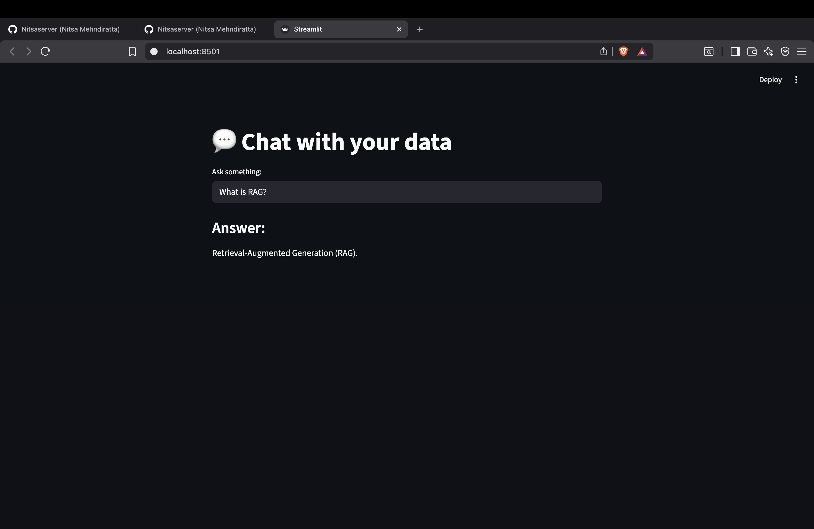

# 🤖 RAG Learning Assistant (LangChain + Ollama)

A simple AI-powered application that demonstrates **Retrieval-Augmented Generation (RAG)** using a local LLM with a clean Streamlit interface.

---

## 🚀 Overview

This project allows users to **ask questions about RAG concepts** and get accurate, context-based answers.

Instead of relying only on the model’s knowledge, the system:

* retrieves relevant information from a text file
* provides that as context to the LLM
* generates grounded, reliable responses

---

## 🧠 What is RAG?

Retrieval-Augmented Generation (RAG) improves AI responses by combining:

* **Information Retrieval** (finding relevant data)
* **Text Generation** (LLM answering based on context)

This reduces hallucination and improves accuracy.

---

## ⚙️ Features

* 💬 Ask questions about RAG concepts
* 🧠 Context-aware answers using retrieval
* ⚡ Fast local inference using Ollama
* 📦 Vector search with FAISS
* 🌐 Simple UI using Streamlit
* 📊 Basic evaluation (relevance, faithfulness, context precision)

---

## 🛠️ Tech Stack

* Python
* LangChain
* Ollama (llama3, nomic-embed-text)
* FAISS (vector database)
* Streamlit

---

## 🏗️ How It Works

1. Load study material (`data.txt`)
2. Split text into chunks
3. Convert chunks into embeddings
4. Store embeddings in FAISS
5. Retrieve relevant chunks for a query
6. Pass context + question to LLM
7. Generate grounded response

---

## ▶️ Run Locally

### 1. Clone the repository

```bash
git clone https://github.com/Nitsaserver/chat-with-your-own-text-file.git
cd chat-with-your-own-text-file
```

### 2. Install dependencies

```bash
pip install -r requirements.txt
```

### 3. Run Ollama (make sure it's installed)

```bash
ollama run llama3
```

### 4. Start the app

```bash
streamlit run app.py
```

---

## 🧪 Example Questions

* What is RAG?
* What are embeddings?
* What is FAISS?
* Why is reranking used?
* What are evaluation metrics?

---

## 📊 Evaluation

The project includes basic evaluation using:

* **Relevance** → Does the answer match the question?
* **Faithfulness** → Is the answer grounded in context?
* **Context Precision** → Is the retrieved context useful?

---

## ⚠️ Limitations

* Uses a local LLM (not deployable as-is)
* Evaluation is simplified (LLM-based)
* No chat memory (single-turn interaction)

---

## 🚀 Future Improvements

* Add chat history (multi-turn conversations)
* Add source citations
* Improve retrieval using reranking
* Deploy using OpenAI API
* Convert into a personal AI portfolio assistant

---

## 👩‍💻 Author

Built as a hands-on learning project to understand RAG systems, LangChain workflows, and AI application design.

---
## DEMO
*
